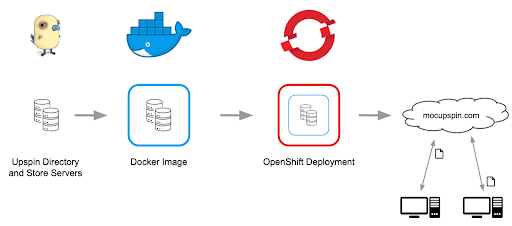
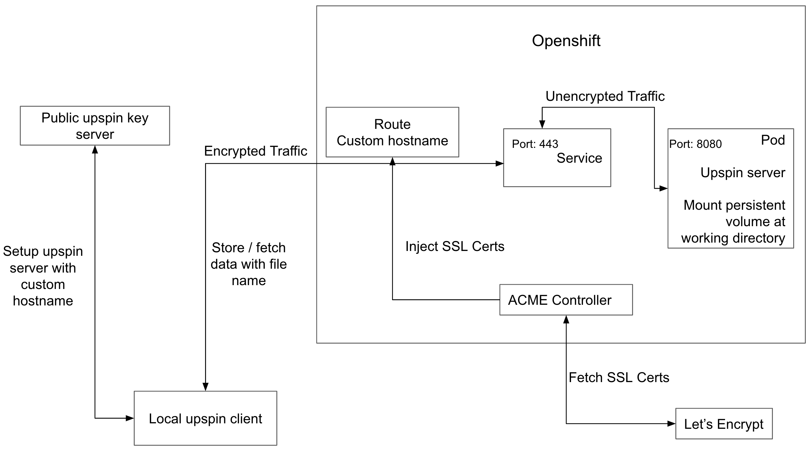

<!-----
NEW: Check the "Suppress top comment" option to remove this info from the output.

Conversion time: 2.054 seconds.

Using this Markdown file:

1. Paste this output into your source file.
2. See the notes and action items below regarding this conversion run.
3. Check the rendered output (headings, lists, code blocks, tables) for proper
   formatting and use a linkchecker before you publish this page.

Conversion notes:

* Docs to Markdown version 1.0β29
* Mon Apr 26 2021 13:57:38 GMT-0700 (PDT)
* Source doc: Project Proposal
* This document has images: check for >>>>>  gd2md-html alert:  inline image link in generated source and store images to your server. NOTE: Images in exported zip file from Google Docs may not appear in  the same order as they do in your doc. Please check the images!

----->

# **Universal Namespace In the Cloud**

<!-----
## **Project Description Template**
The purpose of this Project Description is to present the ideas proposed and decisions made during the preliminary envisioning and inception phase of the project. The goal is to analyze an initial concept proposal at a strategic level of detail and attain/compose an agreement between the project team members and the project customer (mentors and instructors) on the desired solution and overall project direction.

This template proposal contains a number of sections, which you can edit/modify/add/delete/organize as you like. Some key sections we’d like to have in the proposal are:

*   Vision: An executive summary of the vision, goals, users, and general scope of the intended project.
*   Solution Concept: the approach the project team will take to meet the business needs. This section also provides an overview of the architectural and technical designs made for implementing the project.
*   Scope: the boundary of the solution defined by itemizing the intended features and functions in detail, determining what is out of scope, a release strategy and possibly the criteria by which the solution will be accepted by users and operations.

Project Proposal can be used during the follow-up analysis and design meetings to give context to efforts of more detailed technical specifications and plans. It provides a clear direction for the project team; outlines project goals, priorities, and constraints; and sets expectations.
----->

## **1. Vision and Goals Of The Project:**

Dilemma:

Though a variety of cloud services like Apple, Google Photos, Dropbox, and Google Docs provide tremendous convenience for users to manage and share data, their use cases create digital information silos, seperated, segmented, and in lack of a streamlined integration. Moving content between these platforms exemplifies this issue as an user would need to download and then reupload the data. Upspin servers address this issue by allowing for data to be accessed by user groups on an Upspin server without having to continually reshare data to various locations. However, Upspin servers do not have a simple method for deployment on cloud platforms and scaling, which is what our project addressed through automation and documentation of all steps.

Vision:

The vision is to leverage the Upspin project to solve the problems by providing a set of protocols and interfaces for universal access to secure, shareable data, and utilize the MOC’s OpenShift cluster to provide a highly scalable solution. The project creates a global namespace for users’ files based on an e-mail address, as a single reference to the file no matter whether that file is stored in Google Drive, Dropbox or a private Upspin server.

The project takes form in a simple and replicable deployment process for deploying an instance of Upspin server to the OpenShift cluster running on MOC. This would allow Upspin administrators (developers) to quickly deploy and scale their Upspin servers for use in production.

The minimum viable product (MVP) was to deploy a single Upspin instance (served as store server and directory server at the same time) on the MOC’s OpenShift cluster, through:

*   Containerize an Upspin instance (directory and store server);
*   Create OpenShift (Kubernetes) primitives for running the application (deployments, image stream tags, services, routes and pods);
*   Work with public-key infrastructure & SSL certificates to ensure security;
*   Create documentation of all the steps to reproduce the three goals listed above

We also explored the following features (Details would be included in the Scope and Features Of The Project section):

*   Using volumes to protect against data loss during OpenShift outages.
*   Automation of TLS certificate management via the ACME controller.

## **2. Users/Personas Of The Project:**

The primary users for our project are system administrators who wish to quickly containerize Upspin instances and deploy container images to MOC’s OpenShift clusters. There is a secondary use case for individuals (personal users, families or groups of friends) who wish to use our Upspin server(s), but this was not the focus of the project as use of Upspin servers has been accomplished thoroughly. Once a containerized Upspin instance is hosted in the cloud, any user (developer or otherwise) can host data and give access to others, so a major bottleneck now is quickly and easily containerizing and deploying Upspin instances in the cloud.

## **3. Scope and Features Of The Project:**

*   Process to containerize Upspin instance running on OpenShift cluster:
    *   Created a docker image of an upspin instance (combined store and directory server) and running as a docker container.
    *   Made the image support running as an arbitrary user on OpenShift cluster, and resolved permission errors for the working directory.
    *   Created OpenShift primitives for running the application, and deployed a publicly accessible Upspin instance on the MOC’s OpenShift cluster:
    *   Deployment: describes the desired state of a particular component of an application as a Pod template, and orchestrates Pod lifecycles.
    *   Image stream tag: provides an abstraction for referencing Docker images from within OpenShift Container Platform.
    *   Service: serves as an internal load balancer, and identifies a set of replicated pods. Backing pods can be added to or removed from a service arbitrarily while the service remains consistently available. It also provides the mapping between the service port and the actual pod port.
    *   Route: routes the traffic of a certain host name to the designated service at the target port, so that external clients can reach the expected service by host name.
    *   Persistent Volume (PV): a piece of storage in the cluster. We make a request for storage resources by persistent volume claim (PVC). PV and PVC connect specific file system paths of the service back to the OpenShift cluster, so that data is persisted in event of a pod scaled, deleted or restarted, to allow for continuous integration.
*   Worked with CNAME DNS record, public-key infrastructure and TLS certificates to ensure security:
    *   In order to issue a TLS certificate for a hostname from Letsencrypt CA, we need the ownership of the hostname. Since hostnames generated automatically by the OpenShift cluster are not owned by us, we added CNAME DNS records to our custom hostnames pointing to applications on OpenShift.
    *   Deployed an ACME controller on OpenShift cluster, which automatically manages the TLS certificates of custom hostnames of OpenShift services.  With the TLS certificate in hand, we could make sure the traffic between the local upspin client and the remote OpenShift service is encrypted and secure.
*   After a single minimal Upspin instance is successfully running on the MOC’s OpenShift cluster, we explored:
    *   Volumes: added persistent volumes to our Upspin server, which serve to protect against data loss during service outages. This allows system administrators to provide some guarantees on data maintenance while data is hosted on Upspin servers.
    *   Automation: created an automated process for deploying an Upspin instance to OpenShift with the proper TLS certificates. This allows system administrators to quickly and easily begin using Upspin.

## **4. Solution Concept**

The basic solution for this project is to provide an automatic solution for deploying Upspin instances to OpenShift clusters running on MOC.

### Overview of Upspin architecture ([here](https://upspin.io/doc/arch.md))

An individual Upspin user is represented by a username (usually email address) to identify the user. The key server holds the public key and directory server address for each user. For the global Upspin ecosystem, this service is provided by a server running at_ key.upspin.io. _All users can save their public keys there, and can in turn ask the key server for the public keys of any other user in the system. The directory server (in our MVP, will be the same server as the store server) has an association between entries and references to actual data in the store server.

The below diagram illustrates the whole process of retrieving data by a client with a file name. To reiterate, our MVP will have a single, combined directory and store server.

### High Level Overview of Solution Architecture

The high level architecture of our solution starts with the containerization of an upspin instance (directory and store server) via Docker. We then deploy the hosted image (dockerhub) on OpenShift which will serve the upspin instance on it’s auto-generated URL. The last step is to set up a custom hostname to point to this deployment and allow authenticated users to read and write to the upspin instance.

### Low Level Overview of Solution Architecture

Besides the running upspin server on the OpenShift cluster, we also deploy a 3rd party ACME controller, which is for fetching a SSL certificate from Let’s Encrypt CA and attach it to the custom hostname. In order for it to correctly manage SSL certificates for a certain hostname, we have to own that host name by ourselves. That is the reason why we create a custom hostname instead of using the original hostname generated by OpenShift automatically. Now the local upspin client could access the service with the custom hostname via https connection. The encrypted network traffic sent by the client would first reach the port 443 of service, and then the service would unencrypt the traffic and forward the unencrypted traffic to the port 8080 of the actual pod where the upspin server is running.

Then the local upspin client would set up the deployed upspin server. During this process, the local client would first send the custom hostname of the deployed upspin server to the public upspin key server, and then the user root would be created in the upspin server. After the configuration is done, the local client could store data / fetch data with a file name from the deployed upspin server. The local client would first contact the public upspin key server for the hostname of the designated directory server (In our case, both directory server and store server refer to a same pod running on OpenShift), then it would send data and read data back from the deployed upspin server directly.

Lastly, we mount the persistent volume at our working directory. Even if the current pod crashes, all the existing data under the working directory would still be preserved and could be read back after a new pod gets initialized.

## **5. Acceptance criteria**

Our minimum acceptance criteria was a containerized Upspin instance deployed and publicly accessible on the Massachusetts Open Cloud’s OpenShift cluster, which will store the actual data for items and the directory will give references to the data stored, and a repeatable automated process for containerizing and deploying further Upspin instances.

The stretch goals we accomplished are:

*   Persistent volumes being used with the Upspin server in order to provide data consistency during service outages.
*   Automation provided for a system administrator to quickly and easily deploy an Upspin server with all aspects of the MVP and persistent volumes.

## **6. Releases:**

### Iteration/Release 1

Our first iteration consisted of ramping up technical skills along with completion of fundamental tasks which are needed for the MVP. Some of the details of this iteration were:

*   Getting hands-on with Upspin and understanding its architecture and functionality, this included running Upspin on local machines, going over the documentation.
*   Getting familiarized with docker and dockerizing the Upspin binaries and making the docker image available at a registry (in our case, DockerHub).

### Iteration/Release 2

This iteration also focused on familiarizing the team with some of the OpenShift primitives and beginning to explore local UpSpin server configuration. The key tasks and deliverables were:

*   Getting familiar with OpenShift as a container orchestration system and understanding the basic building blocks of it.
*   Beginning to use the OpenShift CLI tool, which would eventually allow us to begin the automation process.

Note: we were also iterating towards a group presentation on the paper Flat Datacenter Storage, so our output in this release was slightly smaller than our output in all other releases.

### Iteration/Release 3

This iteration was mostly focused on iterating towards the actual solution: the design and strategy of deploying the Upspin instance. One of the key tasks/deliverables of this iteration was:

*   Deciding on the approach of the design with regards to level of abstraction and ease of use the solution is going to provide to the user (level of automation).
    *   Eventually decided to provide the MVP (as described above) with persistent volumes and an automation script for deploying.
    *   Similarly, decided to include full documentation for setting up the Upspin server in case a system administrator hoped to deploy an Upspin server with different attributes (e.g. not on OpenShift, not using cloudflare).

### Iteration/Release 4:

This iteration was focused on improving the solution we output for release 3 and fully implementing all aspects of the MVP, automation suite, and persistent volume storage. The key tasks/deliverables of this iteration were:

*   Full automation script to parse a parameters file and fully deploy an Upspin server on OpenShift.
*   Finished developing documentation for all aspects of our project (e.g. deploying Upspin server, configuring cnames, configuring routes, using the OpenShift command line tool).
*   Ensuring persistent volume storage worked as expected: this required cheating a testing plan of scaling down or deleting pods in order to simulate a service failure.
