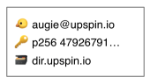
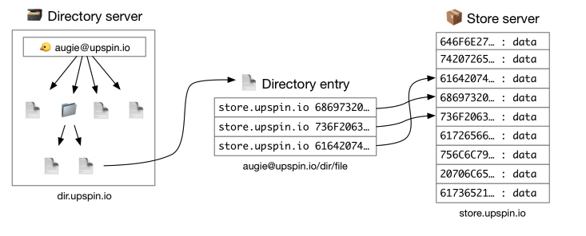
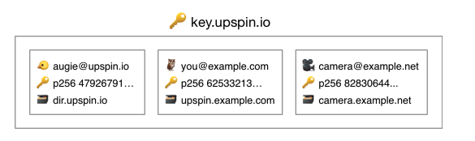

# Universal Namespace In the Cloud

## 1. Vision and Goals Of The Project

**Dilemma:**

Though a variety of cloud services like Apple or Google Photos, Dropbox, and Google Docs provide tremendous convenience for users to manage and share data, their use cases create digital information silos, seperated, segmented, and in lack of a streamlined integration. Moving content between these platforms exemplifies this issue as an user would need to download and then reupload the data.

**Vision:**

The vision is to leverage the Upspin project to solve the problems by providing a set of protocols and interfaces for universal access to secure, shareable data, and utilize the MOC’s OpenShift cluster to provide a highly scalable solution. The project creates a global namespace for users’ files based on an e-mail address, as a single reference to the file no matter whether that file is stored in Google Drive, Dropbox or a private Upspin server.

The project takes form in a simple and replicable deployment process for deploying an instance of Upspin to the OpenShift cluster running on MOC. This would allow Upspin administrators (developers) to quickly host their own instance of OpenShift that could accept new users. 

The minimum viable product (MVP) is to deploy a single Upspin instance (served as store server and directory server at the same time) on the MOC’s OpenShift cluster, through: 

-   Containerize the Upspin instance
-   Work with public-key infrastructure & certificates to ensure security
-   Create OpenShift (Kubernetes) primitives for running the application (routes, pods)

Time permitting, we will explore one or all of the following features (Details would be included in the Scope and Features Of The Project section):

-   Separate the combined Upspin store & directory deployments
-   Explore OpenShift's horizontal scalability
-   Cross-platform deployments
-   Application integration

## 2. Users/Personas Of The Project
The primary users for our project are system administrators who wish to quickly containerize and deploy Upspin instances to MOC’s OpenShift clusters. There is a secondary use case for individuals (personal users, families or groups of friends) who wish to use our Upspin server(s), but this will not be the focus of the project as use of Upspin servers has been accomplished thoroughly. Once a containerized Upspin instance is hosted in the cloud, any user (developer or otherwise) can host data and give access to others, so a major bottleneck now is quickly and easily containerzing and deploying Upspin instances in the cloud.

## 3. Scope and Features Of The Project
-   Process to containerize Upspin:
	-   Will create a docker image of an upspin instance (combined store and directory server) and run as a docker container. 
	-   Will coordinate with public-key infrastructure & certificates to ensure security.
	-   Will include general steps to containerization and provide some automation.
-   Create OpenShift primitives for running the application, and deploy a publicly accessible Upspin instance to the MOC’s OpenShift cluster.
-   After a single minimal Upspin instance is successfully running on the MOC’s OpenShift cluster, we would explore one or all of the following features: 
	-   Scalability: Separate Upspin store & directory deployments. One docker container runs as a directory server and the other docker container runs as a store server. By taking advantage of OpenShift’s horizontal scaling ability, we could provision more directory servers if Upspin users’ requests rise rapidly, and more store servers if Upspin users run out of storage.
	-   Cross-platform deployments: The deployed Upspin instance could be expanded for cross-cloud integration to host files from another cloud storage service (e.g. Dropbox, AWS S3).
	-   Application integration: An Upspin client could be created as a plugin to an existing web service (e.g. create a plugin for GMail or Facebook to utilize the Upspin protocol and pull content from the Upspin instance). We could also integrate the Upspin client with hardware Software Development Kit.

## 4. Solution Concept
#### Overview of Upspin architecture ([here](https://upspin.io/doc/arch.md))

An individual Upsin user is represented by a username to identify the user, public/private key pair, and a network address of a directory server.

The directory server (in our MVP, will be the same server as the store server) has an association between entries and references to actual data in the store server.

The key server holds the public key and directory server address for each user.

A full illustration of the client-server relationship for each server. To reiterate, our MVP will have a single, combined directory and store server.

#### Overview of OpenShift architecture ([here](https://www.openshift.com/learn/what-is-openshift)

OpenShift is a distribution of Kubernetes. OpenShift will be used here to orchestrate the container (combined store and directory server) of Upspin. Upspin will be containerized for deployment on the OpenShift cluster with the store and directory part of the same server. OpenShift is managed through declarative yaml templates ("manifests").

## 5. Acceptance Criteria

Our minimum acceptance criteria is an containerized Upspin instance deployed and publicly accessible on the Massachusetts Open Cloud’s OpenShift cluster with a combined store and directory server, which will store the actual data for items and the directory will give references to the data stored, and a repeatable automated process for containerizing and deploying further Upspin instances.

Our stretch goals may take several different directions:

-   Separate the combined Upspin store & directory deployments.
-   Explore OpenShift's horizontal scalability.
-   Create cross-platform deployments using multiple cloud providers for storage
-   Explore Upspin application integrations, such as creating a plugin for a cloud application like Gmail.
-   Explore integrating with some hardware Software Development Kit.

## 6. Release Planning

**Iteration 1:**
First iteration will consist of ramping up technical skills along with completion of fundamental tasks which are needed for the MVP. Some of the details of this iteration will be:

-   Getting hands-on with the Upspin and understanding its architecture and functionality, this can include running Upspin on local machines, going over the documentation.
    
-   Getting familiarized with docker and dockerizing the Upspin binaries and making the docker image available at a registry (e,g. Dockerhub, Quay or Github).
    
-   Getting familiar with OpenShift as a container orchestration system and understanding the basic building blocks of the same by.
    
**Iteration 2:**
This iteration will be mostly on the actual solution where the team would focus on design and strategy of deploying the Upspin instance. One of the key tasks/deliverables of this iteration would be

-   Deciding on the approach of the design with regards to level of abstraction and ease of use the solution is going to provide to the user (level of automation).

Fine details of this iteration needs to be decided yet based on the outcome of iteration 1 and feedback from the mentors. Depending on the availability of resources (Time) further iterations will be planned post completion of the MVP.

## General comments
We have set the MVP to be a relatively low bar so that we could choose the final form of the project once we’ve used Upspin + OpenShift and are aware of what works well and what doesn’t. Our hope is that more hands-on experiences will help us better identify potential aspects of the project that can be expanded. Thus, we hope to complete the MVP by the mid-term and, time permitting, reset goals to finish more stretch goals.
